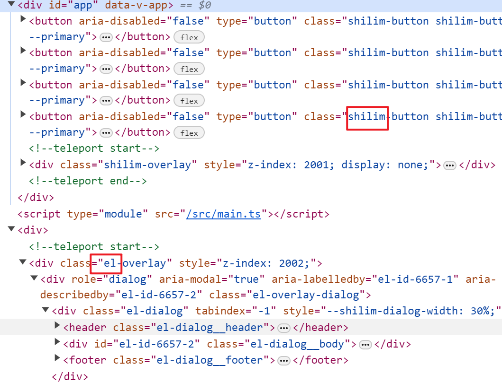
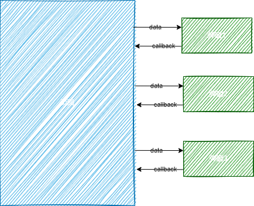

# 前言

前不久看了一篇文章[极致舒适的Vue弹窗使用方案](https://juejin.cn/post/7253062314306322491)，觉得很不错，但是在想使用到项目的过程中，遇到了一些问题。
## 问题一：无法获取el-config-provider的namespace
当使用namespace时，用上面文章中的useCommandComponent去挂载的组件无法获取到其中的namespace

例如修改了namespace
```
<el-config-provider namespace="shilim">
</el-config-provider>
```

使用useCommandComponent去打开弹窗时，发现它的前缀是el而并不是修改后shilim，这种情况下，它的样式也无法生效，导致无法使用



因为作者是参考了ElMessageBox的，于是我使用了一下ElMessageBox发现它居然可以获取得到，于是去看了一下它的源码，最后还是搞不懂它为什么可以获取得到的

## 问题二：无法使用vue-devtool

组件挂上去了之后确实搜不到这个节点，不会显示在vue-devtool中，也试了一下ElMessageBox，也是一样搜不到的

# 对弹窗的思考
