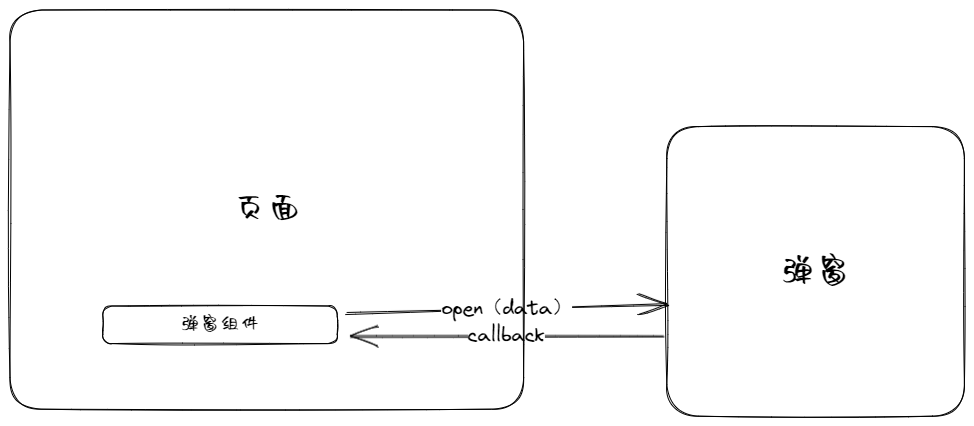

# 前言

前不久看了一篇文章[极致舒适的Vue弹窗使用方案](https://juejin.cn/post/7253062314306322491)，觉得很不错，但是在想使用到项目的过程中，遇到了一些问题。
## 问题一：无法获取el-config-provider的namespace
当使用namespace时，用上面文章中的useCommandComponent去挂载的组件无法获取到其中的namespace

例如修改了namespace
```
<el-config-provider namespace="shilim">
</el-config-provider>
```

使用useCommandComponent去打开弹窗时，发现它的前缀是el而并不是修改后shilim，这种情况下，它的样式也无法生效，导致无法使用


因为作者是参考了ElMessageBox的，于是我使用了一下ElMessageBox发现它居然可以获取得到，于是去看了一下它的源码，最后还是搞不懂它为什么可以获取得到的

## 问题二：无法使用vue-devtool

组件挂上去了之后确实搜不到这个节点，不会显示在vue-devtool中，也试了一下ElMessageBox，也是一样搜不到的

# 对弹窗的思考

目前我遇到的弹窗大致分为两种：一种是数据的预览，一种是表单。在页面复杂的时候时候可能会有很多的弹窗，而一个创建表单的逻辑可能比较复杂，所以，想把每一个弹窗的逻辑独立出去，这样方便维护。也希望弹窗组件完全管理自己的状态，不然很多个弹窗的话，父组件要维护很多的显示状态数据和要传递的数据。于是希望在使用弹窗的时候把弹窗加载进来，再通过弹窗的实例去调用里面的打开弹窗方法，这也是我一开始选择的弹窗方式。


# 使用Ref打开弹窗

每个弹窗组件增加ref，每个弹窗都实现一个open方法，父组件通过ref去调用弹窗组件的open方法，去改变弹窗内容的visible，这样就可以实现弹窗的打开。下面的是我在vue3中的实现：

为了减少重复的状态，使用hook去复用一些代码

**useDialog.ts**
```javascript
import { ref } from "vue";

interface UseDialogParams<T> {
  onBeforeOpen?: (params?: T) => void;
  onAfterOpen?: (params?: T) => void;
  onBeforeClose?: () => void;
  onAfterClose?: () => void;
}

const useDialog = <T>(params?: UseDialogParams<T>) => {
  const visible = ref<boolean>(false);

  const openDialog = (openParams?: T) => {
    params?.onBeforeOpen && params.onBeforeOpen(openParams);
    visible.value = true;
    params?.onAfterOpen && params.onAfterOpen(openParams);
  };

  const closeDialog = () => {
    params?.onBeforeClose && params.onBeforeClose();
    visible.value = false;
    params?.onAfterClose && params.onAfterClose();
  };

  return {
    visible,
    openDialog,
    closeDialog,
  };
};
export default useDialog;

```

**useDialogRef**
```javascript
import { Dialog } from "@/models/dialog";
import { ref } from "vue";

const useDialogRef = <T, U = unknown>() => {
  const dialogRef = ref<Dialog<T> & U>();

  const openDialog = (params?: T) => {
    dialogRef.value?.openDialog(params);
  };

  return {
    dialogRef,
    openDialog,
  };
};
export default useDialogRef;

```

使用
```html
<template>
  <el-config-provider namespace="shilim">
    <el-button
      type="primary"
      @click="openRefDialog({ content: '我是Ref弹窗' })"
    >
      打开Ref弹窗
    </el-button>
    <RefDialog ref="refDialog" />
  </el-config-provider>
</template>

<script setup lang="ts">
const { dialogRef: refDialog, openDialog: openRefDialog } =
  useDialogRef<RefDialogProps>();
</script>
```

弹窗组件
```html
<template>
  <el-dialog v-model="visible" title="Ref弹窗">
    <div>{{ data.content }}</div>
  </el-dialog>
</template>

<script lang="ts" setup>
import useDialog from "@/hook/useDialog";
import { Ref, ref } from "vue";

export interface RefDialogProps {
  content: string;
}

const data: Ref<RefDialogProps> = ref({
  content: "",
});

const dataInit = (props?: RefDialogProps) => {
  // 处理传递的数据
  if (props) {
    data.value = props;
  }
};

const { visible, openDialog } = useDialog<RefDialogProps>({
  onAfterOpen: dataInit,
});
defineExpose({
  openDialog,
});
</script>

<style scoped lang="scss"></style>

```

这样使用的优缺点如下：

优点：
1. 弹窗组件完全管理自己的状态，方便维护
2. 只通过open方法来传递数据，统一入口
3. 代码中出现组件节点，不存在provide和vue-devtool调试问题

缺点：
1. 父组件还是需要维护多个ref
2. 通过ref去调用弹窗组件的方法不是个好的操作，容易直接通过ref直接去修改了弹窗内部的数据，导致混乱，在vue2可能会有，但是定好了规范其实不会出现，vue3有expose也会使不暴露的内容不被提示，也避免了这种问题
3. 弹窗组件会一直存在，每次调用open方法时都需要重置一下数据，vue2可以object.assign(this.$data,this.$options.data())解决，vue3处理就麻烦一点

# 使用DialogManager打开弹窗

这个想法一开始的主要期望是能不能通过一个api，把想要打开的组件传进去，然后传递相应的props和emits，然后动态创建组件。
```
DialogManager.open({
    component: () => import("./dialog.vue"),
    props: {},
    emits: {},
})
```

然后想到动态组件就想到component组件，通过一个弹窗列表去管理弹窗，每次open时，把弹窗组件加入到弹窗列表中，通过component组件去渲染弹窗组件。

也参考了一下createTemplatePromise，希望命令式调用弹窗。因为考虑到可以缓存弹窗，选择用object去存储，key作为组件的唯一标识。参数通过props来传递，因为现在emits也会在props作为onXXX参数，所以只要推导props的类型然后通过props传递就行。 好了，上代码：

**createDialogManager.ts**

```javascript
import DynamicDialog from "@/components/DynamicDialog.vue";
import { DialogComponent } from "@/models/dialog";
import { ComponentProps } from "@/types/vue-type-helper";
import {
  shallowReactive,
  type Component,
  type ComponentOptionsBase,
  reactive,
  h,
} from "vue";

export interface ComponentStore<T extends Component> {
  component: Component; // 模态框组件
  props: (ComponentProps<T> extends any ? {} : ComponentProps<Component>) &
    DialogComponent.Props; // 模态框参数
  key?: string; // 唯一标识
  isCache?: boolean; // 是否缓存
}

export const createDialogManager = () => {
  const componentStore: { [key: string]: ComponentStore<Component> } =
    shallowReactive({});

  const setDialog = <T extends Component>(data: ComponentStore<T>) => {
    // 设置key
    const componentKey =
      data.key ||
      data.component.name ||
      (
        data.component as ComponentOptionsBase<
          any,
          any,
          any,
          any,
          any,
          any,
          any,
          any
        >
      ).__name ||
      "DEFAULT_Dialog";
    // 设置显示
    data.props.visible = true;
    // 设置关闭回调
    data.props.onClosed = () => {
      if (!data.isCache) {
        delete componentStore[componentKey];
      } else {
        componentStore[componentKey].props.visible = false;
      }
    };
    // 已存在模态框
    if (Reflect.has(componentStore, componentKey)) {
      // 缓存的组件，直接修改props
      if (data.isCache) {
        Object.assign(componentStore[componentKey].props, {
          ...data.props,
          visible: true,
        });
      } else {
        // 不缓存组件，删除重新创建
        delete componentStore[componentKey];
        componentStore[componentKey] = { ...data, props: reactive(data.props) };
      }
    } else {
      // 新模态框
      componentStore[componentKey] = { ...data, props: reactive(data.props) };
    }
  };

  const open = <T extends Component>(
    component: T,
    props: Omit<
      ComponentProps<T>,
      "visible" | "onClosed"
    > = {} as ComponentProps<T>,
    key?: string
  ) => {
    const openParams = {
      component,
      props,
      key,
      isCache: false,
    };
    setDialog(openParams as ComponentProps<T>);
  };

  const openInCache = <T extends Component>(
    component: T,
    props: Omit<
      ComponentProps<T>,
      "visible" | "onClosed"
    > = {} as ComponentProps<T>,
    key?: string
  ) => {
    const openParams = {
      component,
      props,
      key,
      isCache: true,
    };
    setDialog(openParams as ComponentProps<T>);
  };
  const component = () => h(DynamicDialog, { componentStore });
  component.open = open;
  component.openInCache = openInCache;
  return component;
};
```

使用：
```html
<template>
  <el-config-provider namespace="shilim">
    <el-button type="primary" @click="openDialogManageDialogCache">
      打开dialogManager弹窗(缓存)
    </el-button>
    <DialogManager />
  </el-config-provider>
</template>

<script setup lang="ts">
import { createDialogManager } from "./hook/createDialogManager";

const DialogManager = createDialogManager();
const openDialogManageDialog = () => {
  DialogManager.open(DialogManagerDialog, {
    content: "我是DialogManagerDialog弹窗",
  });
};
const openDialogManageDialogCache = () => {
  DialogManager.openInCache(
    DialogManagerDialog,
    {
      content: "我是DialogManagerDialog弹窗",
    },
    "DialogManagerDialogCache"
  );
};
</script>
```

**弹窗组件**
```html
<template>
  <ElDialog :model-value="visible" title="dialogManagerDialog" @closed="closed">
    <div>{{ content }}</div>
    <ElInput v-model="inputValue"></ElInput>
  </ElDialog>
</template>

<script setup lang="ts">
import { ElDialog, ElInput } from "element-plus";
import { ref } from "vue";
defineProps<{
  visible: boolean;
  content: string;
}>();

const inputValue = ref("");

const emit = defineEmits<{
  (event: "closed"): void;
}>();

const closed = () => {
  emit("closed");
};
</script>

```

这样使用的优缺点如下：

优点：
1. 弹窗组件完全管理自己的状态，方便维护
2. 只需要一个DialogManager节点就可以
3. 代码中出现组件节点，不存在provide和vue-devtool调试问题

缺点：
1. 子组件必须props包含visible，onClosed两个固定的属性

# 总结
写博客期间也看到很多其他的方式，不过适合自己的才是最好的。

最后放上[github](https://github.com/shilim-developer/vue3-modal-demo)代码。